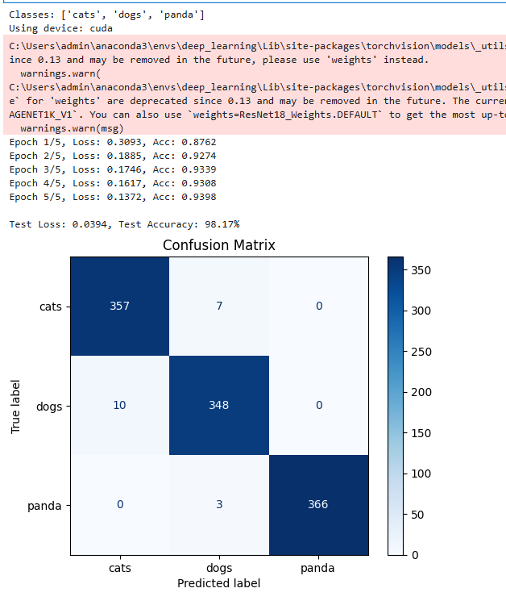

# -AI-Classifier-Identifying-Cats-Dogs-Pandas-with-PyTorch
## 🐱🐶🐼 Cats vs Dogs vs Pandas – Image Classification with PyTorch
📌 Overview
This project is an image classification model that predicts whether an image is a cat, dog, or panda using transfer learning (ResNet18) in PyTorch.

We use the Cats vs Dogs vs Pandas dataset from Kaggle and train with GPU support.
The project follows these steps:

1.Environment Setup
2.Data Preparation
3.Model Design (Transfer Learning)
4.Training
5.Evaluation (Accuracy, Confusion Matrix)
6.Bonus – Single Image Prediction
⚡ Dataset
We used the dataset:
👉 Cats, Dogs, Pandas Dataset on Kaggle

## CODE :

```PY
# ==========================================
# 1. IMPORTS & SETUP
# ==========================================
import torch
import torch.nn as nn
import torch.optim as optim
from torchvision import datasets, transforms, models
from torch.utils.data import DataLoader
import numpy as np
import matplotlib.pyplot as plt
from PIL import Image
from sklearn.metrics import confusion_matrix, ConfusionMatrixDisplay

torch.manual_seed(42)
np.random.seed(42)

# ==========================================
# 2. DATA PREPARATION
# ==========================================
data_dir = "./dataset"  # Structure: data/train/{cats,dogs,panda}, data/test/{cats,dogs,panda}

# Image transformations
train_transforms = transforms.Compose([
    transforms.RandomResizedCrop(224),
    transforms.RandomHorizontalFlip(),
    transforms.ToTensor(),
    transforms.Normalize([0.485, 0.456, 0.406],
                         [0.229, 0.224, 0.225])
])

test_transforms = transforms.Compose([
    transforms.Resize((224, 224)),
    transforms.ToTensor(),
    transforms.Normalize([0.485, 0.456, 0.406],
                         [0.229, 0.224, 0.225])
])

# Load datasets
train_data = datasets.ImageFolder(data_dir + "/train", transform=train_transforms)
test_data  = datasets.ImageFolder(data_dir + "/test", transform=test_transforms)

train_loader = DataLoader(train_data, batch_size=32, shuffle=True)
test_loader  = DataLoader(test_data, batch_size=32, shuffle=False)

class_names = train_data.classes
print("Classes:", class_names)

# ==========================================
# 3. MODEL DESIGN (Transfer Learning with ResNet18)
# ==========================================
device = torch.device("cuda" if torch.cuda.is_available() else "cpu")
print("Using device:", device)

model = models.resnet18(pretrained=True)

# Freeze backbone
for param in model.parameters():
    param.requires_grad = False

# Replace final layer for our 3 classes
in_features = model.fc.in_features
model.fc = nn.Sequential(
    nn.Linear(in_features, 256),
    nn.ReLU(),
    nn.Dropout(0.5),
    nn.Linear(256, len(class_names))  # 3 classes
)
model = model.to(device)

# Loss & Optimizer
criterion = nn.CrossEntropyLoss()
optimizer = optim.Adam(model.fc.parameters(), lr=0.001)

# ==========================================
# 4. TRAINING
# ==========================================
epochs = 5  # Try more epochs if dataset is large
for epoch in range(epochs):
    model.train()
    running_loss, correct = 0.0, 0

    for inputs, labels in train_loader:
        inputs, labels = inputs.to(device), labels.to(device)

        optimizer.zero_grad()
        outputs = model(inputs)
        loss = criterion(outputs, labels)
        loss.backward()
        optimizer.step()

        running_loss += loss.item() * inputs.size(0)
        _, preds = torch.max(outputs, 1)
        correct += (preds == labels).sum().item()

    epoch_loss = running_loss / len(train_data)
    epoch_acc = correct / len(train_data)
    print(f"Epoch {epoch+1}/{epochs}, Loss: {epoch_loss:.4f}, Acc: {epoch_acc:.4f}")

# ==========================================
# 5. EVALUATION
# ==========================================
model.eval()
test_correct, test_loss = 0, 0.0
all_preds, all_labels = [], []

with torch.no_grad():
    for inputs, labels in test_loader:
        inputs, labels = inputs.to(device), labels.to(device)
        outputs = model(inputs)
        loss = criterion(outputs, labels)
        test_loss += loss.item() * inputs.size(0)
        _, preds = torch.max(outputs, 1)

        test_correct += (preds == labels).sum().item()
        all_preds.extend(preds.cpu().numpy())
        all_labels.extend(labels.cpu().numpy())

test_loss /= len(test_data)
test_acc = test_correct / len(test_data)
print(f"\nTest Loss: {test_loss:.4f}, Test Accuracy: {test_acc*100:.2f}%")


cm = confusion_matrix(all_labels, all_preds)
disp = ConfusionMatrixDisplay(confusion_matrix=cm, display_labels=class_names)
disp.plot(cmap="Blues")
plt.title("Confusion Matrix")
plt.show()

# ==========================================
# 6. BONUS – Prediction Function
# ==========================================
def predict_image(image_path):
    img = Image.open(image_path).convert("RGB")
    transform = test_transforms
    img_tensor = transform(img).unsqueeze(0).to(device)

    model.eval()
    with torch.no_grad():
        outputs = model(img_tensor)
        _, pred = torch.max(outputs, 1)
        prob = torch.softmax(outputs, dim=1)[0][pred].item() * 100

    result = class_names[pred.item()]
    print(f"Prediction: {result} ({prob:.2f}% confidence)")
    return result
```

## OUTPUT :
